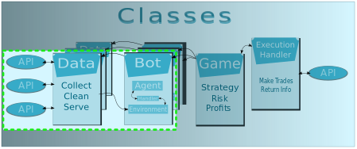

# tradeMachine
Stock Trading Beginnings

### Thank You to:   
Source|Link|For   
------- |  -------- | -------   
**Galvanize Staff** | [GitHub](https://github.com/gSchool) | Everything
**Siraj Raval** | [GitHub](https://github.com/llSourcell) | ML / Time Series
**Derrick Mwiti** | [Medium](https://heartbeat.fritz.ai/using-a-keras-long-shortterm-memory-lstm-model-to-predict-stock-prices-a08c9f69aa74) | LSTM Stocks

Note - I reused no code, but ideas are just as important.   
I make no guarantees, though you probably don't want to use this model.

#### The goal is to create a stock trading machine.  
   

This has varying levels of complexity but as an MVP we want the following:  
* Collect Time Based Data: Prices, News, Multiple Stocks  
* Create a Neural Network to predict data through time  
* Extras: Execute trades, manage a portfolio, RL

#### Limited Project Scope for Capstone 2  
   

With the above structure, we can focus on the "bot" and it's beginnings.  
- [ ] Check data instances or start new data instance (allows multiple bots on same stock)
- [x] Train up to current time on given stock (cram)
- [ ] Train on new data as time progresses (update)
- [x] Be controlled easily (reset, change parameters, kill)  
- [x] And obviously, predict stuff

### Review of Current Methods  
#### Time Series Methods   
- [ ] ARIMA    
- [ ] RNN  
- [x] +LSTM  
- [ ] Gut Feel (Humans)  

#### Stock Trading (IMO)  
- [ ] Intraday/High Frequency (Technicals, Statistics, Some Indicators)  
- [ ] EOD (Technicals, Indicators, News)  
- [x] Swing/Position (Macro News, Specific News, Indicators)   
- [ ] Trend Trading (Buy, Sell, Hold, Ride Trend)   

### Putting it Together

The flow of information through the bot will be as follows:  
The handler provides the bot with information (prices for now)
State information is the length of the time window, and is passed element
by element into a scaling function
Information is passed element-wise into input LSTM nodes  
Typical cascade through the network, except output is scaled price prediction

### The Brain for Now
Inputs: Settled on 3 weeks of daily price (~3000 Train, ~1000 test, Window of 21 Days)  
Long Short Term Memory Layer (100 Units, 'tanh')   
Dropout Layer at 30%   
Dense Layer (20 Units, 'relu')   
Output Layer (7 Future Days)   

  

#### Getting There
It was a rough start...    

   

   

Eventually (Eventually), I settled in on the parameters you noticed above
which... yielded "believable" results.   

   

   

In an effort to allow the LSTM to adaptively filter the data, I did not do so.  
In hindsight, the seemingly random variance hides trends, perhaps unobservable but I am not convinced of that yet.  

   

#### Reflections
1) The above changing variance screams non-stationary data, but we know these signals have "forcing functions" i.e. uncertainty in the market or what have you.   
2) It appears our bot has learned quite quickly to predict the mean of the incoming data.
Given both (1) and (2), I look forward to including tons of non-traditional data now that I have a working model.  

Out of curiosity, what follows is the cumulative sum of the previously "differenced" data.  
Theoretically, the sum would yield the original data yet in the prediction, we predict on windows.  
One alternative is an expanding window instead of a sliding window. I could not explore the ramifications of this to the LSTM.  
Meaning: Later timesteps would include the option bot to use discounted earlier information but this is more computationally expensive.

